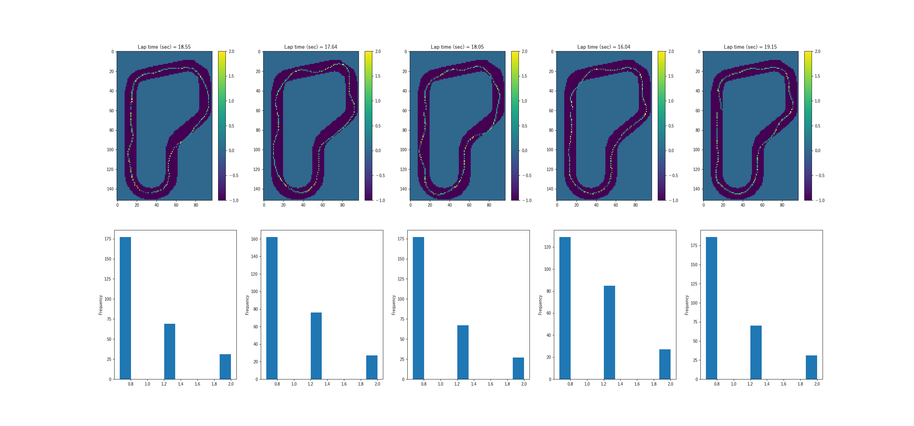

# Simulation Run Log Analysis and Visualization for AWS DeepRacer

### Description

This sample code is for analyzing and debugging using the AWS DeepRacer Simulation logs.

### Dependencies
- AWS CLI
- Python 3.7

In addition, please add the project folder to PYTHONPATH and `conca install` the following packages:
- `boto3`
- `pandas`
- `matplotlib`
- `shapely`

### Preparation ###

- git clone and checkout commit-id 4d0448b97b1ae277839223752652f9e07d277eaf.

```
mkdir -p aws-deepracer-workshops
cd aws-deepracer-workshops
git init
git remote add origin https://github.com/aws-samples/aws-deepracer-workshops.git
git fetch --depth 1 origin 4d0448b97b1ae277839223752652f9e07d277eaf
git reset --hard FETCH_HEAD
```

- ~~Duplicate some files to copy and place them there.~~
```
cd ..
mkdir -p logs utils
cp -fr aws-deepracer-workshops/log-analysis/tracks .
cp aws-deepracer-workshops/log-analysis/log_analysis.py utils/.
cp aws-deepracer-workshops/log-analysis/cw_utils.py     utils/.
```

### Run visualization and analysis ###

- Download the evaluation log of the specified sim-id.

```
python log_download.py --sim_id sim-dl533hr387wm
```

- Visualize and analyze the downloaded evaluation logs. 

```
python log_analysis_eval.py --sim_id sim-dl533hr387wm | tee eval-dl533hr387wm-haradatm.log

Episode #0 
Outer polygon length = 78.23 (meters)
Inner polygon length = 63.13 (meters)
Distance, lap time = 17.19 (meters), 18.55 (sec)
Average throttle, velocity = 0.98 (Gazebo), 0.93 (meters/sec)
###############################################################

Episode #1 
Outer polygon length = 78.23 (meters)
Inner polygon length = 63.13 (meters)
Distance, lap time = 17.53 (meters), 17.64 (sec)
Average throttle, velocity = 0.99 (Gazebo), 0.99 (meters/sec)
###############################################################

Episode #2 
Outer polygon length = 78.23 (meters)
Inner polygon length = 63.13 (meters)
Distance, lap time = 17.29 (meters), 18.05 (sec)
Average throttle, velocity = 0.97 (Gazebo), 0.96 (meters/sec)
###############################################################

Episode #3 
Outer polygon length = 78.23 (meters)
Inner polygon length = 63.13 (meters)
Distance, lap time = 17.13 (meters), 16.04 (sec)
Average throttle, velocity = 1.05 (Gazebo), 1.07 (meters/sec)
###############################################################

Episode #4 
Outer polygon length = 78.23 (meters)
Inner polygon length = 63.13 (meters)
Distance, lap time = 17.18 (meters), 19.15 (sec)
Average throttle, velocity = 0.97 (Gazebo), 0.90 (meters/sec)
###############################################################
```

[Plot](outputs/sim-dl533hr387wm.png)


